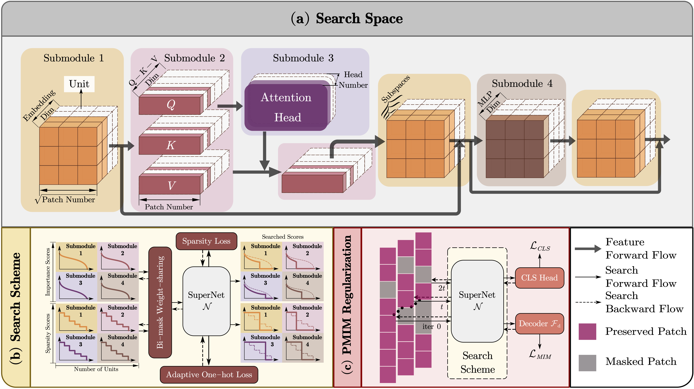

[](https://arxiv.org/abs/2403.15835)
[](https://github.com/HankYe/Once-for-Both/issues)
[](https://github.com/HankYe/Once-for-Both/pulls)

# CVPR-2024: Once-For-Both (OFB)

### Introduction
This is the official repository to the CVPR 2024 paper "[**Once for Both: Single Stage of Importance and Sparsity Search for Vision Transformer Compression**](https://arxiv.org/abs/2403.15835)". OFB is a novel one-stage search paradigm containing a bi-mask weight sharing scheme, an adaptive one-hot loss function, and progressive masked image modeling to efficiently learn the importance and sparsity score distributions.

### Abstract
In this work, for the first time, we investigate how to integrate the evaluations of importance and sparsity scores into a single stage, searching the optimal subnets in an efficient manner. Specifically, we present OFB, a cost-efficient approach that simultaneously evaluates both importance and sparsity scores, termed Once for Both (OFB), for VTC. First, a bi-mask scheme is developed by entangling the importance score and the differentiable sparsity score to jointly determine the pruning potential (prunability) of each unit. Such a bi-mask search strategy is further used together with a proposed adaptive one-hot loss to realize the progressiveand-efficient search for the most important subnet. Finally, Progressive Masked Image Modeling (PMIM) is proposed to regularize the feature space to be more representative during the search process, which may be degraded by the dimension reduction.
<div align=center>

</div>

### Main Results on ImageNet
[assets]: https://github.com/HankYe/Once-for-Both/releases

|Model |size<br><sup>(pixels) |Top-1 (%) |Top-5 (%)  |params<br><sup>(M) |FLOPs<br><sup>224 (B)
|---                      |---  |---      |---      |---   |---
|[OFB-DeiT-A][assets]     |224  |75.0     |92.3     |4.4   |0.9
|[OFB-DeiT-B][assets]     |224  |76.1     |92.8     |5.3   |1.1
|[OFB-DeiT-C][assets]     |224  |78.0     |93.9     |8.0   |1.7
|[OFB-DeiT-D][assets]     |224  |80.3     |95.1     |17.6  |3.6
|[OFB-DeiT-E][assets]     |224  |81.7     |95.8     |43.9  |8.7

<!-- |Model |size<br><sup>(pixels) |Top-1 (%) |Top-5 (%)  |params<br><sup>(M) |FLOPs<br><sup>224 (B)
|---                      |---  |---      |---      |---   |---
|[OFB-Swin-A][assets]     |224  |76.5     |93.1     |6.1   |1.0
|[OFB-Swin-B][assets]     |224  |79.9     |94.6     |16.4  |2.6
|[OFB-Swin-C][assets]     |224  |80.5     |94.8     |18.9  |3.1 -->

</details>
<details open>
<summary>Install</summary>

[**Python>=3.8.0**](https://www.python.org/) is required with all [requirements.txt](https://github.com/HankYe/Once-for-Both/blob/master/requirements.txt):

```bash
$ git clone https://github.com/HankYe/Once-for-Both
$ cd Once-for-Both
$ conda create -n OFB python==3.8
$ pip install -r requirements.txt
```

</details>

### Data preparation
The layout of Imagenet data:
```bash
/path/to/imagenet/
  train/
    class1/
      img1.jpeg
    class2/
      img2.jpeg
  val/
    class1/
      img1.jpeg
    class2/
      img2.jpeg
``` 

### Searching and Finetuning (Optional)
Here is a sample script to search on DeiT-S model with 2 GPUs.
```
cd exp_sh
sh run_exp.sh
```

## Citation
Please cite our paper in your publications if it helps your research.

    @InProceedings{Ye_2024_CVPR,
    author    = {Ye, Hancheng and Yu, Chong and Ye, Peng and Xia, Renqiu and Tang, Yansong and Lu, Jiwen and Chen, Tao and Zhang, Bo},
    title     = {Once for Both: Single Stage of Importance and Sparsity Search for Vision Transformer Compression},
    booktitle = {Proceedings of the IEEE/CVF Conference on Computer Vision and Pattern Recognition (CVPR)},
    month     = {June},
    year      = {2024},
    pages     = {5578-5588}
    }
    


## License
This project is licensed under the MIT License.

### Acknowledgement
We greatly acknowledge the authors of _ViT-Slim_ and _DeiT_ for their open-source codes. Visit the following links to access more contributions of them.
* [ViT-Slim](https://github.com/Arnav0400/ViT-Slim/tree/master/ViT-Slim)
* [DeiT](https://github.com/facebookresearch/deit)